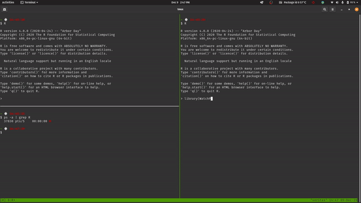

# WatchPID

<!-- badges: start -->
<!-- badges: end -->

WatchPID provides a simple, single function that watches a "process id" (PID) at given intervals, and executes functions if that process is *alive* or *dead*.

## Installation

You can install WatchPID from github:

``` r
remotes::install_github("rmflight/WatchPID")
```

## Example

Here is a gif of an example where we are watching another R process every 1 second, and simply reporting if it is alive or dead:



## Note Use of Functions!

Note that `watch_pid` evaluates passed functions, so whatever you want to have happen when the process is still alive or it's dead, that needs to be a function.
Here are some examples:

``` r
report_alive = function(){
  message("still alive!")
}
report_dead = function(){
  message("it's dead now ...")
}

watch_pid(pid, dead_action = report_dead, alive_action = report_alive)
```

Notice these are functions without any arguments.

## Other Options

You could also use the [beepr](https://cran.r-project.org/web/packages/beepr/index.html) package to play sounds locally, or [textme](https://github.com/richpauloo/textme) to text yourself from something on a remote machine (cluster?!, AWS, etc).

``` r
beepr_dead = function(){
  beepr::beep(2)
}

textme_dead = function(){
  textme::textme("it died :-(")
}
```

## Determining Your Process ID

When I am using this, there is normally a single `R` process running on the machine where I want to watch it.
In that case, it is simple to find using the `ps` command.

```
ps -a | grep R
```

This should return the process ID that you are looking for.

## Command Line Executable

It is possible to create a command line executable that uses the `Rscript` binary to evaluate and run it, you can see an example in [watch_textme.R](exec/watch_textme.R).
The main advantage to using an executable is not having to start a separate R process, and making sure you are capturing the correct one when you are searching for it using `ps`.

If you copy this file somewhere and set it to executable, and make sure the path to `Rscript` is properly set at the top, and make sure {docopt} and {textme} are installed, then you can simply do:

```
./watch_textme.R --pid=PROCESSID --dead-message="the process has died"
```

Note that because of shell rules around quotes, don't use the "'" character in the `--dead-message` parameter.
Just don't.
You will get an error and wonder why.

## Issues

If you find any issues, please report them [here](https://github.com/rmflight/WatchPID/issues).
